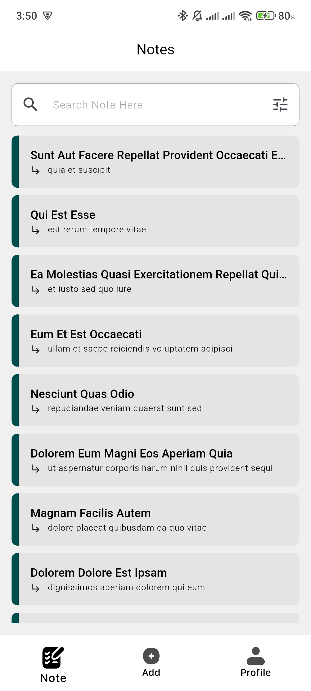
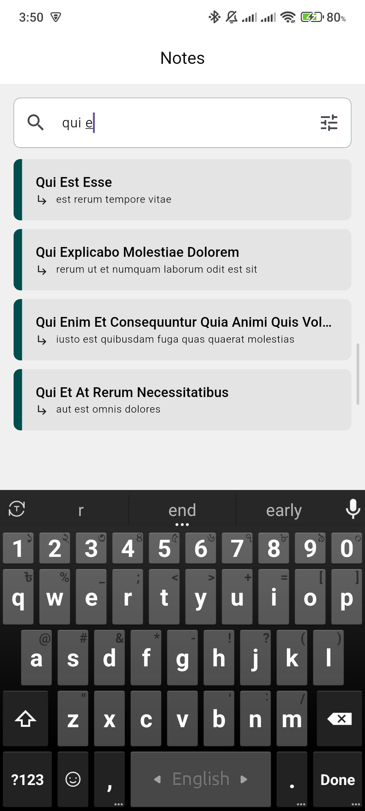
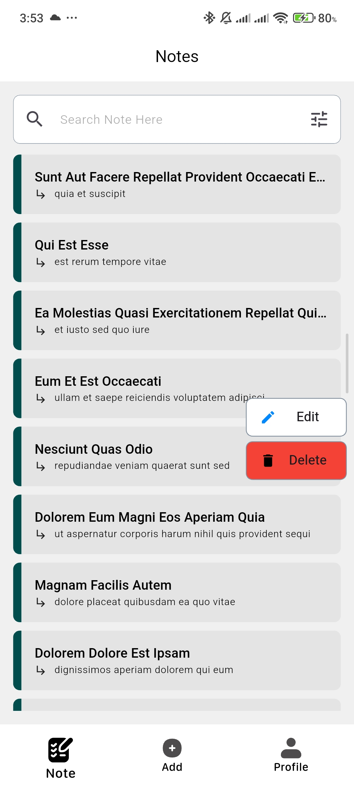
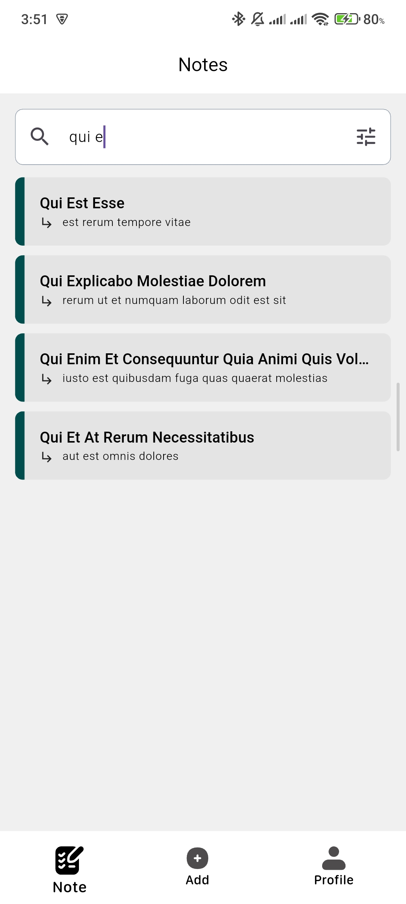
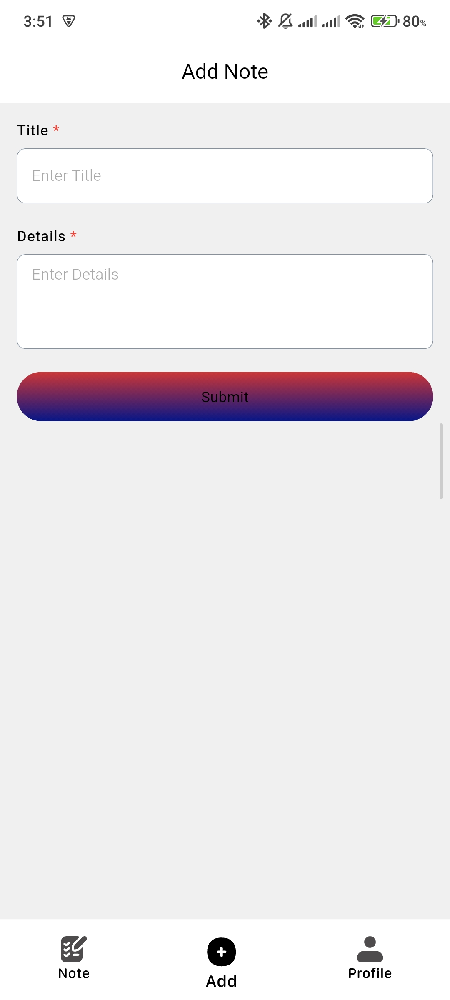
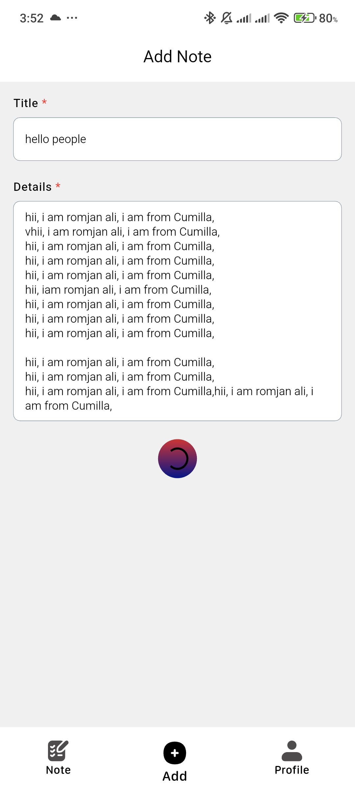
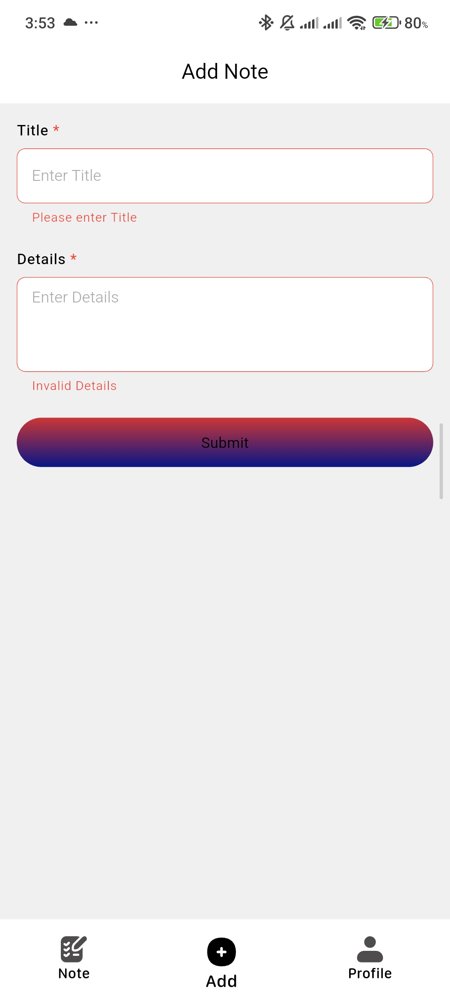

## Project Name : Task Three

Project Architecture : Clean Architecture.

### features
1. Dark/Light mode
2. Landing page
3. Skeleton/shimmer loader 
4. Edit, Delete Pop-Up
5. Exit pop-up
7. filter by title
8. pull to refresh
9. edit/delete
11. local store first
12. sync failed request when network available.
13. title, body validation
14. loading button on submit with animation.
15. trafic logging.
16. duplicate call prevent.

## screens

